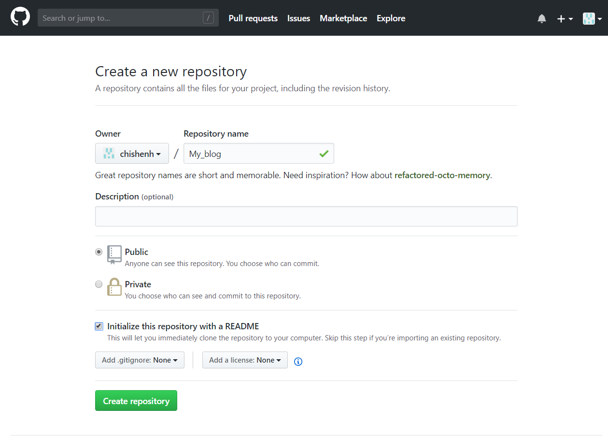
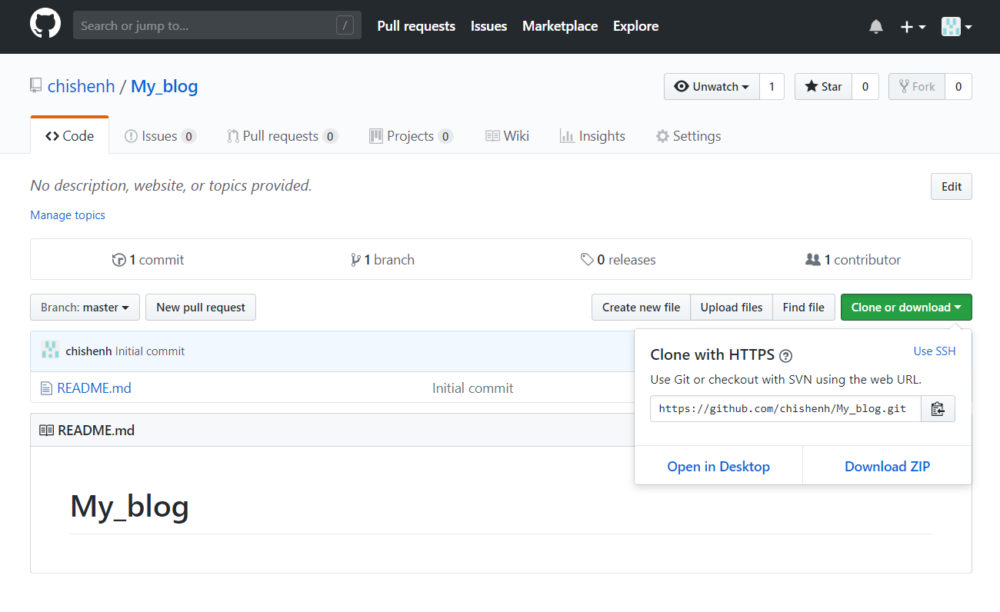
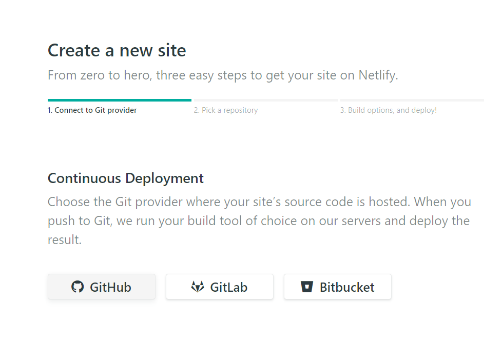
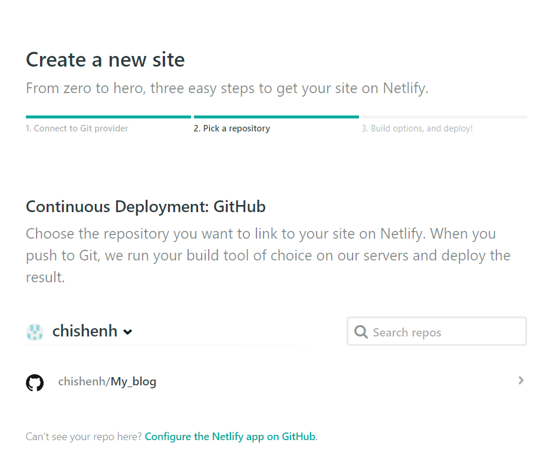
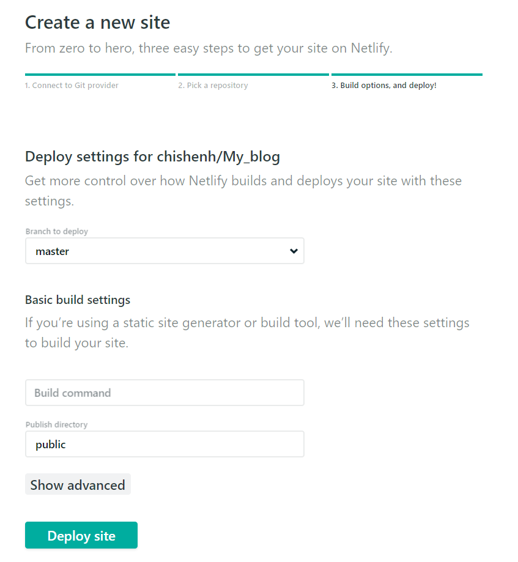

從學生時代開始直到工作兩年多，累積了許多 R 程式使用經驗，想把它們整理成一個好用的工具集，一方面可以使往後的工作流程更加順暢，再來就是希望可以將自己寫 R 的經驗和大家做交流。

之前就曾稍微了解一下 `RMarkdown` 可以用來有效率的呈現分析成果以及用到的 R 語法，也發現有人開發了 R 的 `blogdown` 套件以及 `bookdown` 套件，可以用來寫 blog 和電子書，十分方便，但是一直沒有機會去用看看。直到最近工作有了一點空檔，才想到要來把之前寫過的程式整理一下。以下開始就是建 Blog 的流程：

<br />

##**在 Github 建一個新知識庫**

1. 先在 [Github](https://github.com/){target="_blank"} 註冊，並建立一個知識庫 (Repository) 準備用來放置網站檔案。初始化設定如下：

2. 點選 `clone or download` 並複製網址

3. 打開終端機輸入 `cd <本地位址>` 將目錄設定在本地要放置網站內容的資料夾，本文是 `c:\My_blog`。下載 [git](https://git-scm.com/){target="_blank"} 並安裝後，執行 `git clone <Github url>` 把剛剛建立的 Repository 複製到本地端。

<br />

##**安裝相關軟體**

blogdown 的背景平台是 R 语言，用户界面 RStudio ，網站框架是 Hugo。安装方式如下：

+ `R`。在 R 的伺服器 [CRAN](https://cran.r-project.org/){target="_blank"} 下載對應系統版本的 R。

+ `RStudio`。到[官網](https://www.rstudio.com/){target="_blank"}下載

+ `blogdown`。打開 RStudio，在 Console 面板輸入以下 code:
```{r,eval=FALSE}
install.packages('devtools')
devtools::install_github('rstudio/blogdown')
```
+ `Hugo`。在 RStudio Console 面板輸入:
```{r,eval=FALSE}
blogdown::install_hugo()
```

<br />

##**用 R blogdown 創建個人網站**

在 RStudio 裡輸入：
```{r,eval=FALSE}
blogdown::new_site(dir='c:\\My_blog',
                   theme = 'gcushen/hugo-academic',
                   format = 'toml')
```
這個函數透過 `theme` 來設定樣板，可以在 [Hugo’s theme gallery](https://themes.gohugo.io/){target="_blank"} 挑選自己喜歡的，這邊使用的是很受學術使用者歡迎的 [Academic](https://themes.gohugo.io/academic/){target="_blank"} 樣板作為示範。`format = 'toml` 告訴 `blogdown` 產生 `config.toml` 檔案來紀錄網站的配置，將來可以在這裡做配置的相關設定。

執行之後網站就建起來了，RStudio viewer 會啟動預覽，也可以在瀏覽器開啟預覽


這時 `c:\Myblog` 裡面會出現許多資料夾，網站的主要內容就在 `content\` 及 `public\` 內。

<br />

##**將部落格部屬到網路上**

1. 先將準備好的網站內容 Push 到 Github 上：
```{git}
git init
git add .
git commit -m "First Commit"
git remote add origin https://github.com/chishenh/My_blog
git remote -v
git pull origin master --allow-unrelated-histories
git push -u origin master
```

2. 到 [Netlify](https://www.netlify.com/){target="_blank"} 註冊帳號並登入，選擇與Github做連動。


3. 選擇網站要對應的 Repository，此處是My_Blog


4. 網站設定


5. 等 Netlify 部署好網頁，會得到一串隨機產生的網址，可以到 `Site setting` 裡的 `Change site name` 更改成自己想要的網址名稱。

<br />

##**新增網站內容**

有兩種方法

1. 將原有的 `.md` 或 `.Rmd` 複製到 `content\` 中的目的位置，更改標題及內容。
2. 在 RStudio 的代碼列 `Addins` 中點選 `New Post` ，並依提示填寫相關內容即可。

完成內容編輯之後，運行 `Serve Site`，並用 git Push 到 Github 上，Netlify 就會自動完成更新。

<br />

##**參考資料**

+ [Academic](https://sourcethemes.com/academic/docs/)
+ [Building a Blog with Blogdown and GitHub](https://tclavelle.github.io/blog/blogdown_github/)
+ [Building a Static Blog with Blogdown, Hugo and GitHub](https://statnmath.github.io/2018/01/building-a-static-blog-with-blogdown-hugo-and-github-rmd/)
+ [本站是如何建成的：R blogdown 简介](http://xuer.dapengde.com/post/hugo-blogdown/)
+ [用 R 语言的 blogdown+hugo+netlify+github 建博客](https://cosx.org/2018/01/build-blog-with-blogdown-hugo-netlify-github/)


