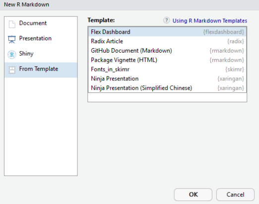

以往在做分析結果的報告時，必須將分析結果的圖形或表格在 power point 上排版。常常會遇到排版加上美化，就花去很多時間，顯得很沒效率。如果一定要 `docx` 或 `pptx`，可以使用 [officer](https://davidgohel.github.io/officer/){target="_blank"}  套件，讓 R 直接編輯並輸出檔案。

另外一種是使用 R 語言中系統性的輸出方案，分成兩大類：

1. [shiny](https://shiny.rstudio.com/){target="_blank"} + [shinydashboard](https://rstudio.github.io/shinydashboard/){target="_blank"} 

因 `shiny` 需要在部屬 R 服務端時作用，並使用 `shinydashboard` 作為前端顯示結果的 UI，因此這個方案我只會在用自己的電腦進行分析時使用。若你可以對你進行報告的電腦做好 R Shiny 部署，可以使用這個方案。

2. [rmarkdown](https://rmarkdown.rstudio.com/){target="_blank"} + [flexdashboard](https://rmarkdown.rstudio.com/flexdashboard/){target="_blank"} :

`rmarkdown` 是 markdwon 語法的擴展，可以讓 R 語言在 markdown 中運作。而 `flexdashboard` 則類似於 `shinydashboard`，可以使　`rmarkdown` 靈活的佈局、擴展，而且可以輸出 `pdf`、`docx`、`tex` 及 `html` 等格式的文件檔，十分直覺且方便。

本文針對沒有部屬 R 後臺服務時，採用 `rmarkdown + flexdashboard` 一次性輸出的 html 檔案來進行簡報或結果展示。以下對於各種佈局進行示範，以及其對應的 `rmd` 編碼。請注意，因為是 RWD 自適應頁面以及螢幕解析度的關係，在手機上看可能無法顯示完整的佈局。　

<br />

## **一.安裝套件**

在 `Rstudio` 中進行套件安裝：
```{r,eval=F}
install.packages("rmarkdown")
install.packages("flexdashboard")
```

安裝完成後，從選單新增 `Rmarkdown` 的文件，選擇 `flexdashboard` 的底版進行編輯



## **二.佈局介紹**

### Single_Column (Fill)

當文件頭 yaml 中的參數設定 `vertical_layout: fill` 時，所有圖表的高度會根據當前瀏覽器頁面高度自動調整。

<iframe seamless src="/html/Single_Column_Fill.html" width="100%" height="800"></iframe>
<script src="https://gist.github.com/chishenh/2e019f806328722cf8e9ceae2e64a8d5.js"></script>

<br />

### Single_Column (Scroll)

當文件頭 yaml 中的參數設定 `vertical_layout: scroll` 時，瀏覽器中顯示的圖表會保持原本大小不變動，若超出頁面則以捲軸拉選。

<iframe seamless src="/html/Single_Column_Scroll.html" width="100%" height="800"></iframe>
<script src="https://gist.github.com/chishenh/ea67dfaf63ced249e9455f2ff78f0bf6.js"></script>


<br />

### Multiple Columns

`flexdashboard` 可以多列佈局，只要在程式碼中宣告 `Column` 參數即可，並可定義各列列寬。

<iframe seamless src="/html/Multiple_Columns.html" width="100%" height="800"></iframe>
<script src="https://gist.github.com/chishenh/669d13a479301a113df10d38e307d0b7.js"></script>

<br />

### Row Orientation

多行佈局和多列佈局類似，只要在 yaml 中加入參數設定 `orientation: rows`，並將程式碼中 `Column` 改成 `Row` 即可。同樣可定義各行的行高。

<iframe seamless src="/html/Row_Orientation.html" width="100%" height="800"></iframe>
<script src="https://gist.github.com/chishenh/743f38f1bc67979345c1da5dac3a345a.js"></script>

<br />

### Tabset Column

使用 `flexdashoard` 中的 `{.tabset}` 可以讓頁面在指定的 Column 上產生切換功能

<iframe seamless src="/html/Tabset_Column.html" width="100%" height="800"></iframe>
<script src="https://gist.github.com/chishenh/43a89be1d6aadac218f13128a3aa03da.js"></script>

<br />

### Tabset Row

使用 `flexdashoard` 中的 `{.tabset}` 可以讓頁面在指定的 Row 上產生切換功能

<iframe seamless src="/html/Tabset_Row.html" width="100%" height="800"></iframe>
<script src="https://gist.github.com/chishenh/edc58228607f954bc96e6d62acbd8265.js"></script>

<br />

### Multiple Pages

`flexdashoard` 使用 `level 1 markdown header (==============)` 進行多頁佈局。


<iframe seamless src="/html/Multiple_Pages.html" width="100%" height="800"></iframe>
<script src="https://gist.github.com/chishenh/0be98c1b85a6b81ff18bc60e4e5b3ff4.js"></script>

<br />

### StoryBoard

故事版面

<iframe seamless src="/html/Storyboard.html" width="100%" height="800"></iframe>
<script src="https://gist.github.com/chishenh/fb1679b3aabd2161da5e5739453f40d2.js"></script>

<br />

### Sidebar

側邊攔可以輸入說明或註解

<iframe seamless src="/html/Sidebar.html" width="100%" height="800"></iframe>
<script src="https://gist.github.com/chishenh/3d829a0c744bc66611cee398cbcf13d4.js"></script>