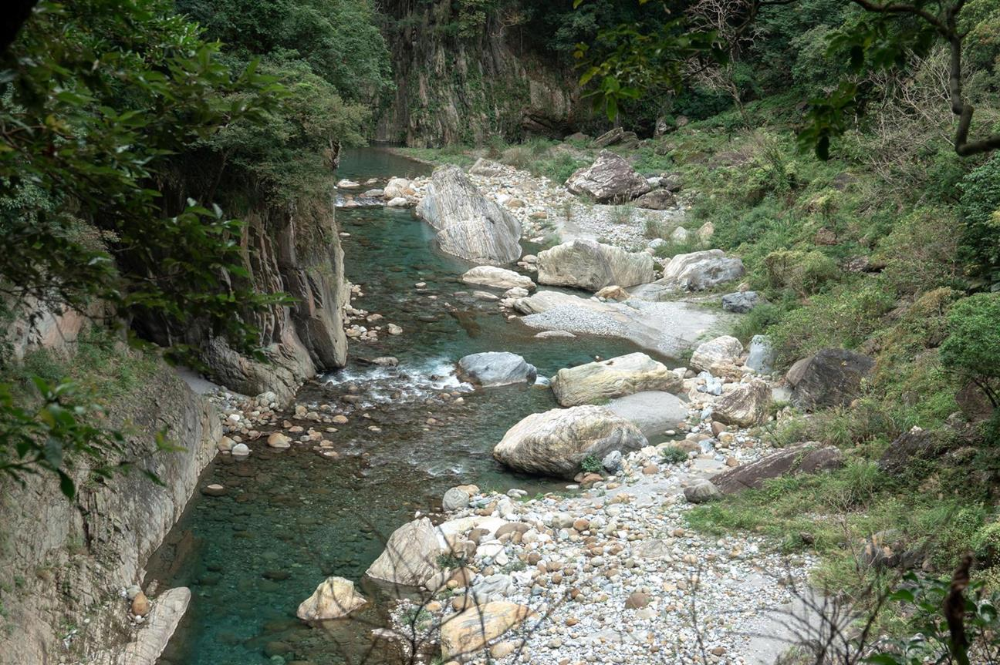
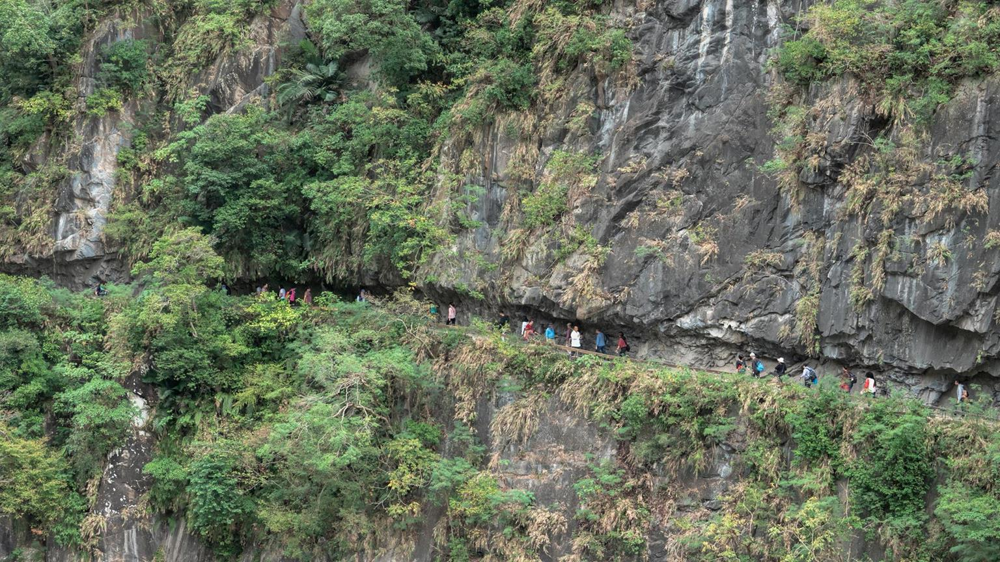
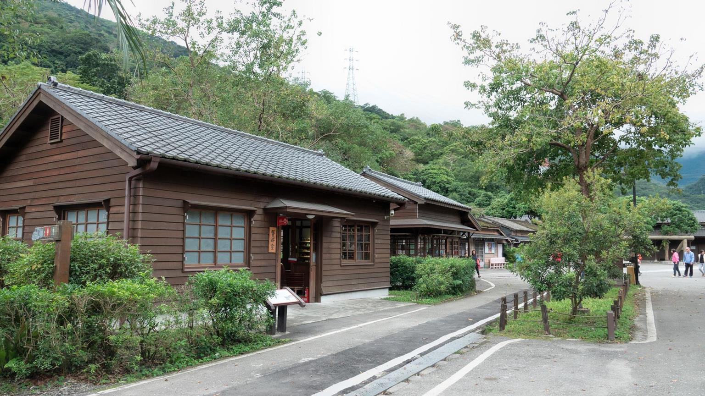

<figure>  
<figcaption>95mm, F3.5, 1/100, ISO 200</figcaption>
</figure>

喜歡攝影以來，出去旅遊總是會好好思索一下需要怎麼樣的攝影裝備，考慮的內容包含旅途距離、路況、天氣等，畢竟旅遊的機會難得，總是會想要用最適合的器材把美好的回憶畫面留下來，每每到最後總是會有這樣的念頭：再多帶一顆鏡頭吧！中長定焦拍出好的人像；再多帶一台機身吧！雙機流就不用一直換鏡頭了，避免入塵也不會遺漏美好瞬間！

隨著拍攝經驗累積，慢慢總結出：```器材帶得出去才是最重要的！``` 一旦負重太大，人都被器材綁住了可能連遊興都減了，實在很難拍出什麼好照片。因此決定就帶一台 RX10M4 去旅遊，好好試試它的功能。剛好這個月趁著觀光局的旅遊補助，全家去了花蓮二日遊，接下來就跟大家分享一些 RX10M4 旅遊實戰拍攝結果。


### **砂卡礑步道**
上次來花蓮已經是四、五年前，剛買人生第一台相機的時候，不過翻了翻舊照片，好像沒有幾張在步道的照片? 鑿石而成的步道，沿著溪流而行，這裡的景致相對複雜，我想當初應該是對鏡頭焦段和相機的操控還不熟悉吧，不知從何拍起。

<figure>  
<figcaption>24mm, F4.0, 1/30, ISO 320</figcaption>
<figcaption>24mm, F2.4, 1/100, ISO 100</figcaption>
</figure>

沿著步道邊長滿了樹木和長草，走在步道上用 RX10M4 拉長焦距拍攝溪流，可以避免樹木和草影響畫面，讓溪流主體明確乾淨些。

<figure>  
<figcaption>65mm, F3.5, 1/125, ISO 100</figcaption>
<figcaption>149mm, F4.0, 1/160, ISO 160</figcaption>
</figure>


女兒正值學步期，不時地就想下來自己走路。邊走的過程邊拉開一點距離，用眼控對焦，可以很輕鬆的捕捉這樣的畫面。

<figure>  
<figcaption>97mm, F3.5, 1/160, ISO 800</figcaption>
<figcaption>83mm, F3.5, 1/160, ISO 640</figcaption>
</figure>

五年前的印象只有橋上的石獅塑像@@，是用標準大光圈定焦拍攝，這次用 RX10M4 拉長一點焦距，可以避免主體變形，同時製造散景。

<figure>  
<figcaption>104mm, F4.0, 1/250, ISO 100</figcaption>
</figure>

在橋上拍攝步道的外觀，靈活的焦段讓我可以取得適當的構圖。

<figure>  
<figcaption>83mm, F3.5, 1/160, ISO 250</figcaption>
</figure>

### **燕子口**

由於前一天地震，燕子口這邊只到比較安全的路段才下車走走。造山運動形成的巧奪天工，RX10M4 的靈活焦段可以運用於各種角度的構圖，在很短的下車行走時間裡拍到比較豐富的內容。

<figure>  
<figcaption>24mm, F4.0, 1/125, ISO 100</figcaption>
<figcaption>91mm, F4.0, 1/100, ISO 200</figcaption>
<figcaption>61mm, F4.0, 1/80, ISO 160</figcaption>
<figcaption>39mm, F4.0, 1/40, ISO 160</figcaption>
<figcaption>50mm, F4.0, 1/50, ISO 100</figcaption>
</figure>

### **慈母橋**

下車 10 分鐘的匆匆一瞥。趕快拍了幾張到此一遊照，以及廣角望遠各拍幾張。

<figure>  
<figcaption>74mm, F3.5, 1/200, ISO 100</figcaption>
<figcaption>54mm, F4.0, 1/60, ISO 100</figcaption>
<figcaption>24mm, F4.0, 1/160, ISO 100</figcaption>
</figure>

### **長春祠**

到了長春祠，我們只是在遠方的休息小站下車，並沒有時間走到祠內。剛好來測試一下慢速快門拍攝瀑布。這次出門並沒有帶腳架，只能將相機放在觀景台的欄杆上拍攝。拍攝個步驟如下：關閉防震機制 --> 調整焦距構圖 --> 手動調整參數 --> 使用到數計時 2 秒快門 --> 完成。

因為沒有帶減光鏡，當時天氣又不錯，使用慢速快門一如預期的照片會過曝，回家後用 Lightroom 將曝光拉回，效果還真不錯！色調能忠實地還原，細節也都保留得很完整。

<figure>  
<figcaption>91mm, F8.0, 0.3, ISO 100</figcaption>
<figcaption>95mm, F8.0, 0.4, ISO 100</figcaption>
</figure>

### **清水斷崖**

斷崖的景色不管廣角或是稍微特寫，都很有特色。這也是旅遊中帶著 RX10M4 的好處：同一個地點可以拍攝不同視野。

<figure>  
<figcaption>72mm, F4.0, 1/125, ISO 100</figcaption>
<figcaption>600mm, F4.0, 1/250, ISO 125</figcaption>
</figure>

### **七星潭 光復糖廠 北回歸線 瑞穗牧場**

這幾個是比較芭樂的點，大部分就是拍些到此一遊^^

<figure>  
<figcaption>68mm, F4.0, 1/125, ISO 100</figcaption>
<figcaption>351mm, F4.0, 1/250, ISO 200</figcaption>
<figcaption>159mm, F4.0, 1/250, ISO 125</figcaption>
<figcaption>79mm, F4.0, 1/400, ISO 100</figcaption>
<figcaption>170mm, F4.0, 1/500, ISO 100</figcaption>
<figcaption>85mm, F4.0, 1/500, ISO 100</figcaption>
<figcaption>58mm, F4.0, 1/160, ISO 100</figcaption>
</figure>

### **林田山**

林田山林場，在日據時代是以林業為中心而形成的聚落，生活所需應有盡有，宛如一個功能完整的小城市。一屋一物瀰漫著某種特殊的木頭情感，很熟悉，景緻也是隨拍成畫的盡興。

<figure>  
<figcaption>24mm, F4.0, 1/60, ISO 100</figcaption>
<figcaption>25mm, F4.0, 1/60, ISO 100</figcaption>
<figcaption>79mm, F4.0, 1/80, ISO 200</figcaption>
<figcaption>40mm, F4.0, 1/40, ISO 160</figcaption>
<figcaption>29mm, F2.8, 1/200, ISO 320</figcaption>
<figcaption>34mm, F2.8, 1/40, ISO 125</figcaption>
<figcaption>27mm, F2.5, 1/50, ISO 100</figcaption>
<figcaption>88mm, F3.5, 1/100, ISO 320</figcaption>
</figure>

### **雲山水**

最後一站：雲山水。記憶中的純淨優美及夢幻迷濛，如今多了商業氣息。原本的寬闊填塞了許多壯麗的民宿，巨型玩偶和壁畫也同時進駐了雲山水。夢幻湖景已經擋著高大的落羽松圈圍成的高牆，只能在樹縫中欣賞著美麗的湛藍。

<figure>  
<figcaption>56mm, F4.0, 1/80, ISO 100</figcaption>
<figcaption>54mm, F4.0, 1/80, ISO 100</figcaption>
<figcaption>115mm, F4.0, 1/200, ISO 400</figcaption>
</figure>

## **總結**

這次的家庭旅遊多了一個小小孩和一部嬰兒推車，若是再背個兩機四鏡之類的，我想大概第二天就會把大部分器材放在旅館，只帶一機一鏡，因為實在太負擔了！輕便、行動方便真的是很重要的考量，特別是 RX10M4 24-600mm 範圍超廣的焦段和優越的對焦能力，真的可以實現一機到底，旅遊中的精彩畫面也不會因為換鏡頭遺漏，這是最寶貴之處！
