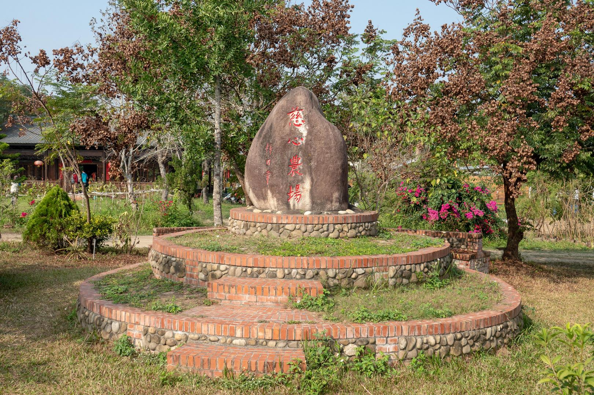
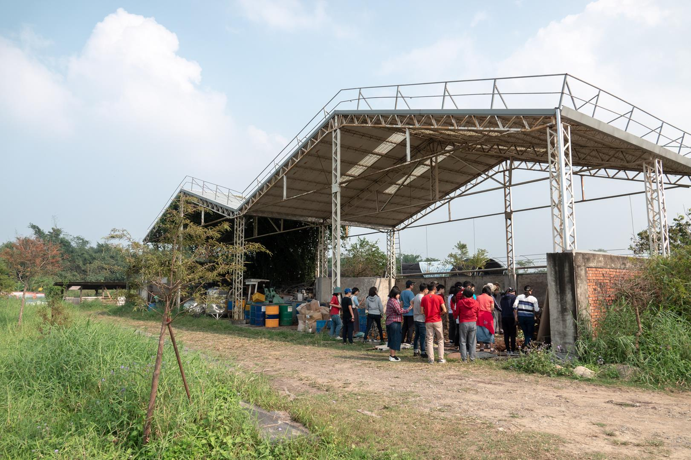

活動紀錄往往以人為主角，輔以情境場景，拍攝時搭配各種角度、遠近、人帶場景比例分配等來呈現一個活動的樣貌。需要考慮的因素也很多，舉凡活動動靜態比例、場地幅員大小、天氣狀況等，這些都要事先有一定的了解，甚至擬一個拍攝的腳本，來達到理想的拍攝記錄。

在變化多端的因素下，一支可遠可近的長焦旅遊鏡當然是不錯的選擇。然而選擇長焦鏡頭的的諸多考慮：畫質、重量、價錢，在前篇介紹已有提及，這時 RX10M4 就提供了一個最佳方案：輕巧、長焦、對焦優秀、畫質佳，本篇分享以 RX10M4 紀錄活動時各個面向的實戰經驗，讓有類似需求的人可以參考。

 

## **古坑慈心農場**

這次是到[古坑慈心大自然莊園](https://www.facebook.com/ORGANIC.FARM151/?rf=559412750742704)參訪，時間是十二月一日。農場最大的特色就是一群人用慈心找回生態，給予眾多生命安全的棲息地，許多動物們都享受於慈心田野中，悠然自在。120 多公頃的有機農田，食物豐富又安全，許多保育類生物也出現其中。可惜參訪的時間有限，否則這裡應該是生態攝影的天堂。

### **建築與環境**
這是一個教育農場，主要推廣慈心的理念。農場的建築、家俱、器具等都是惜福物件，整體環境雖然沒有現代的華麗設計感，卻很直接地散發一種忠實復古的氣氛，身在其中自然而然就覺得放鬆。RX10M4 的 24-600mm 蔡司鏡頭可以用不同的焦段來呈現建築特色或場景氛圍。
<figure>  
<figcaption>35mm, F2.8, 1/1000, ISO 100</figcaption>
<figcaption>81mm, F3.5, 1/500, ISO 100</figcaption>
<figcaption>72mm, F3.5, 1/250, ISO 100</figcaption>
<figcaption>26mm, F2.5, 1/200, ISO 100</figcaption>
<figcaption>30mm, F2.8, 1/80, ISO 100</figcaption>
<figcaption>30mm, F2.8, 1/1600, ISO 100</figcaption>
</figure>
### **動物**
許多動物優遊自在地生活在農場中，它們已是農場的一份子，每當有賓客來訪，總是熱情地歡迎。拍攝時需要保持一點距離，太近的話可能會造成驚擾，這時候 RX10M4 的長焦鏡頭和優秀的對焦能力就發揮了作用，可以拍下動物們的真實生活樣貌。
<figure>  
<figcaption>289mm, F4.0, 1/640, ISO 100</figcaption>
<figcaption>600mm, F4.0, 1/640, ISO 100</figcaption>
<figcaption>400mm, F4.0, 1/500, ISO 100</figcaption>
<figcaption>493mm, F4.0, 1/320, ISO 100</figcaption>
<figcaption>436mm, F4.0, 1/500, ISO 100</figcaption>
<figcaption>222mm, F4.0, 1/320, ISO 100</figcaption>
</figure>

### **人物記錄**
人物是紀錄的主角，當導覽解說或是活動紀錄時，近距離較不易拍攝到整體的畫面，用超廣角鏡頭又容易造成人物變形，這時 RX10M4 就可以靈活的運用，採用長焦距從遠處拍攝，可以記錄到活動較完整的樣貌，又不會打擾到活動中的角色，需要特寫也可以再拉近，很方便。
<figure>  
<figcaption>119mm, F4.0, 1/125, ISO 400</figcaption>
<figcaption>30mm, F2.8, 1/1250, ISO 100</figcaption>
<figcaption>184mm, F4.0, 1/200, ISO 100</figcaption>
<figcaption>310mm, F4.0, 1/250, ISO 125</figcaption>
<figcaption>238mm, F4.0, 1/250, ISO 125</figcaption>
<figcaption>238mm, F4.0, 1/250, ISO 125</figcaption>
<figcaption>131mm, F4.0, 1/320, ISO 100</figcaption>
<figcaption>24mm, F2.4, 1/2000, ISO 100</figcaption>
<figcaption>43mm, F3.2, 1/320, ISO 100</figcaption>
</figure>

RX10M4 拍人的絕佳利器：眼控對焦，讓你可以專心的捕捉瞬間以及構圖，提高拍攝到有趣畫面的機會。
<figure>  
<figcaption>79mm, F3.5, 1/200, ISO 100</figcaption>
<figcaption>598mm, F4.0, 1/640, ISO 100</figcaption>
</figure>
### **靜物**
用 RX10M4 的長焦來拍攝靜物、花卉等，放大倍率非常理想，還可以製造出美麗的散景。
<figure>  
<figcaption>300mm, F4.0, 1/640, ISO 100</figcaption>
<figcaption>600mm, F4.0, 1/640, ISO 100</figcaption>
<figcaption>214mm, F4.0, 1/320, ISO 100</figcaption>
<figcaption>591mm, F4.0, 1/400, ISO 100</figcaption>
</figure>
拍攝蜂蝶等昆蟲時，優先考慮的是準焦，有時候需要以裁切進行二次構圖。 RX10M4 搭配 2010 萬畫素的感光元件，在這種狀況下裁切也很足夠。
<figure>  
<figcaption>517mm, F4.0, 1/640, ISO 100</figcaption>
<figcaption>600mm, F4.0, 1/400, ISO 100</figcaption>
</figure>
拉長焦距拍攝遠方池中的蓮花，輕而易舉，這是一般相機較難達成的。
<figure>  
<figcaption>600mm, F4.0, 1/640, ISO 250</figcaption>
<figcaption>600mm, F6.3, 1/640, ISO 100</figcaption>
</figure>
### **飛羽**
拍攝飛羽當然是 RX10M4 的強項。苦楝樹上鳥兒正在大快朵頤，使用 small 對焦範圍，可以避免自動對焦被複雜的枝葉影響而飄移，準確地對焦在鳥兒身上。
<figure>  
<figcaption>600mm, F4.0, 1/800, ISO 100</figcaption>
<figcaption>600mm, F4.0, 1/800, ISO 100</figcaption>
</figure>
遠方的菱角蓮花池中，肉眼只隱約看到有水鳥，使用 RX10M4 的清晰影像縮放加上連拍，幸運地拍到紅冠水雞在池面上凌波微步。
<figure>  
<figcaption>(600mm, F4.0, 1/1000, ISO 250)</figcaption>
</figure> 
### **總結**
作為活動紀錄使用的相機，RX10M4 功能非常全面，能遠能近、動靜皆宜，幾乎可以一機完成所有的拍攝，若再加上三軸穩定器輔助，可以拍出更有專業感的畫面。以下影片中的素材幾乎都是使用 RX10M4 拍攝，並透過 Wi-fi 支接傳輸到手機上進行初版剪輯編排，非常方便。
